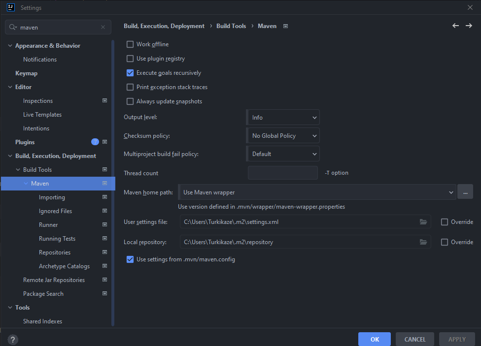

# Zeugnis Aufstieg Projekt
Dies ist ein Schul-Projekt für DBI, welches eine Spring Boot Rest-Application ist. Frontend des Projektes ist eine Reactjs - Application.

# Ausführung Spring Boot Application

Beide Applications sind in der ZIP-Datei. Frontend finden Sie unter dem Ordner **/frontend**. Um die Spring boot Application auszuführen brauchen Sie eine IDE die Spring Boot und Maven unterstützt. Beispiel dafür ist IntelliJ. Dieser erkennt direkt, dass die Application eine Spring Boot Application ist und führt jegliche Maven commands aus. Dabei muss auch beachtet werden, dass Maven eingestellt wurde.  Um es abzuchecken, gehen Sie auf die Einstellungen und suchen sie nach Maven:

Danach können Sie die Application normal ausführen.

Das Projekt läuft auf port: 8080

# Ausführung ReactJS

Um das Frontend ausführen zu können müssen Sie NodeJs auf ihrem Gerät bereits haben.

Gehen sie mit der CMD auf den frontend Folder:

    cd frontend

und führen Sie folgenden Command aus:

    npm i

Nachdem alle dependecies installiert wurden können Sie das Projekt mit folgendem Command ausführen:

    npm start

Das Frontend läuft auf port: 1000

